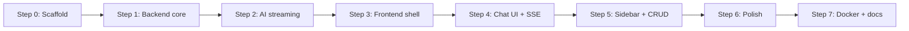

# Chatbot — Implementation Plan

This plan turns [REQUIREMENTS.md](./REQUIREMENTS.md) into buildable steps. Work top-to-bottom within each phase; later phases depend on earlier ones.

---

## 1. Repository Layout

```
chatbot/
├── backend/
│   ├── app/
│   │   ├── __init__.py
│   │   ├── main.py                 # FastAPI app, CORS, routers
│   │   ├── config.py               # pydantic-settings (env)
│   │   ├── database.py             # engine, session, Base
│   │   ├── models/
│   │   │   ├── __init__.py
│   │   │   ├── conversation.py
│   │   │   └── message.py
│   │   ├── schemas/
│   │   │   ├── __init__.py
│   │   │   ├── conversation.py
│   │   │   └── message.py
│   │   ├── routers/
│   │   │   ├── __init__.py
│   │   │   ├── health.py
│   │   │   ├── conversations.py
│   │   │   └── chat.py
│   │   ├── services/
│   │   │   ├── __init__.py
│   │   │   ├── conversation_service.py
│   │   │   └── ai/
│   │   │       ├── __init__.py
│   │   │       ├── base.py         # abstract stream interface
│   │   │       ├── openai_provider.py
│   │   │       └── ollama_provider.py
│   │   └── utils/
│   │       └── sse.py              # SSE formatting helpers
│   ├── alembic/
│   ├── alembic.ini
│   ├── requirements.txt
│   ├── .env.example
│   └── Dockerfile
├── frontend/
│   ├── src/
│   │   ├── main.tsx
│   │   ├── App.tsx
│   │   ├── api/
│   │   │   ├── client.ts           # fetch wrapper, base URL
│   │   │   ├── conversations.ts
│   │   │   └── chat.ts             # SSE stream consumer
│   │   ├── hooks/
│   │   │   ├── useConversations.ts
│   │   │   └── useChatStream.ts
│   │   ├── components/
│   │   │   ├── layout/
│   │   │   │   ├── AppLayout.tsx
│   │   │   │   ├── Sidebar.tsx
│   │   │   │   └── AppBar.tsx
│   │   │   └── chat/
│   │   │       ├── ChatPanel.tsx
│   │   │       ├── MessageList.tsx
│   │   │       ├── MessageBubble.tsx
│   │   │       ├── ChatInput.tsx
│   │   │       └── EmptyState.tsx
│   │   ├── theme/
│   │   │   └── theme.ts
│   │   └── types/
│   │       └── index.ts
│   ├── package.json
│   ├── vite.config.ts
│   ├── .env.example
│   └── Dockerfile
├── docker-compose.yml
├── .gitignore
├── REQUIREMENTS.md
├── PLAN.md
└── README.md
```

---

## 2. Build Order Overview



| Step | Focus | Outcome |
|------|--------|---------|
| 0 | Monorepo scaffold | Empty backend + frontend run locally |
| 1 | Backend core | DB models, conversation CRUD, health |
| 2 | AI layer | OpenAI streaming via SSE chat endpoint |
| 3 | Frontend shell | MUI layout, React Query, API client |
| 4 | Chat UI | Send message, stream tokens, persist |
| 5 | Sidebar | List/delete/rename conversations |
| 6 | Polish | Markdown, cancel, copy, Ollama, errors |
| 7 | DevOps | Docker Compose, README, `.env.example` |

**Strategy:** Backend Steps 0–2 first (API testable with curl/HTTPie), then frontend Steps 3–4 for end-to-end MVP, then polish.

---

## 3. Step 0 — Project Scaffold

**Goal:** Both apps start with zero features; shared gitignore and env templates.

### Tasks

| # | Task | Details |
|---|------|---------|
| 0.1 | Init monorepo | `.gitignore` (Python, Node, `.env`, `*.db`) |
| 0.2 | Backend scaffold | `requirements.txt`, `app/main.py` with `/api/health` stub |
| 0.3 | Frontend scaffold | `npm create vite@latest` → React + TypeScript |
| 0.4 | Add MUI | `@mui/material`, `@emotion/react`, `@emotion/styled` |
| 0.5 | Env templates | `backend/.env.example`, `frontend/.env.example` |
| 0.6 | Vite proxy | Proxy `/api` → `http://localhost:8000` in dev |

### Backend `requirements.txt` (initial)

```
fastapi>=0.115.0
uvicorn[standard]>=0.32.0
sqlalchemy>=2.0.0
alembic>=1.14.0
pydantic-settings>=2.6.0
openai>=1.55.0
httpx>=0.28.0
python-dotenv>=1.0.0
```

### Verify

```bash
cd backend && uvicorn app.main:app --reload   # GET /api/health → 200
cd frontend && npm run dev                     # blank page loads
```

---

## 4. Step 1 — Backend Core (DB + Conversations)

**Goal:** Persist conversations and messages; full CRUD except chat streaming.

### Tasks

| # | Task | File(s) | Notes |
|---|------|---------|-------|
| 1.1 | Config | `config.py` | `DATABASE_URL`, `CORS_ORIGINS`, `AI_*` vars |
| 1.2 | Database setup | `database.py` | SQLite `sqlite:///./chatbot.db`, session dependency |
| 1.3 | SQLAlchemy models | `models/` | UUID PKs, `Conversation`, `Message` with FK + cascade delete |
| 1.4 | Pydantic schemas | `schemas/` | Request/response DTOs, `MessageRole` enum |
| 1.5 | Alembic init | `alembic/` | Initial migration for both tables |
| 1.6 | Conversation service | `conversation_service.py` | CRUD + list messages ordered by `created_at` |
| 1.7 | Routers | `routers/conversations.py`, `health.py` | Match API contract in REQUIREMENTS §7 |
| 1.8 | Wire app | `main.py` | Include routers, CORS, lifespan (create tables or run migrations) |

### Data model details

- `Conversation.title` default `"New chat"`
- `Message.role`: `user` | `assistant` | `system`
- Index on `Message(conversation_id, created_at)`
- On delete conversation → cascade delete messages

### API responses (sketch)

```json
// GET /api/conversations
[{ "id": "...", "title": "...", "created_at": "...", "updated_at": "..." }]

// GET /api/conversations/{id}
{
  "id": "...",
  "title": "...",
  "messages": [
    { "id": "...", "role": "user", "content": "...", "created_at": "..." }
  ]
}
```

### Verify

- `POST /api/conversations` → returns new id
- `GET /api/conversations/{id}` → empty messages
- `PATCH` title, `DELETE` conversation
- DB file created with correct schema

---

## 5. Step 2 — AI Service + Streaming Chat

**Goal:** `POST /api/conversations/{id}/chat` saves user message, streams AI reply, saves assistant message.

### Tasks

| # | Task | File(s) | Notes |
|---|------|---------|-------|
| 2.1 | AI base interface | `services/ai/base.py` | `async def stream(messages) -> AsyncIterator[str]` |
| 2.2 | OpenAI provider | `openai_provider.py` | `client.chat.completions.create(stream=True)` |
| 2.3 | Provider factory | `services/ai/__init__.py` | Read `AI_PROVIDER` from config; return correct provider |
| 2.4 | SSE helper | `utils/sse.py` | Format `event: token\ndata: {...}\n\n` |
| 2.5 | Chat router | `routers/chat.py` | Validate message length (max 8000), load history |
| 2.6 | Chat flow | `chat.py` + service | 1) Save user msg 2) Build context 3) Stream 4) Save assistant msg 5) `event: done` |
| 2.7 | System prompt | `config.py` | `SYSTEM_PROMPT` env var with sensible default |
| 2.8 | Context window | chat service | Send system + last N messages (e.g. 50) to control tokens |
| 2.9 | Auto-title | conversation service | On first user message, set title = first 50 chars |
| 2.10 | Error handling | chat router | `event: error` on provider failure; HTTP 502 with detail |

### SSE event contract

| Event | Payload | When |
|-------|---------|------|
| `token` | `{"content": "partial"}` | Each streamed chunk |
| `done` | `{"message_id": "uuid"}` | After assistant message saved |
| `error` | `{"detail": "..."}` | Provider or internal error |

### Chat endpoint flow

```
POST /api/conversations/{id}/chat  { "message": "Hello" }
  │
  ├─ Validate conversation exists
  ├─ Insert user message
  ├─ Build messages[] for AI (system + history)
  ├─ Stream tokens via SSE
  ├─ Accumulate full response
  ├─ Insert assistant message
  ├─ Update conversation.updated_at
  └─ Emit done with message_id
```

### Verify

```bash
curl -N -X POST http://localhost:8000/api/conversations/{id}/chat \
  -H "Content-Type: application/json" \
  -d '{"message":"Say hi in one word"}' 
# See SSE token events, then done
```

- Messages persisted in DB after stream completes
- Health endpoint reports `provider` and `model`

---

## 6. Step 3 — Frontend Shell

**Goal:** MUI app shell, API client, React Query — no chat logic yet.

### Tasks

| # | Task | File(s) | Notes |
|---|------|---------|-------|
| 3.1 | TypeScript types | `types/index.ts` | Mirror backend schemas |
| 3.2 | API client | `api/client.ts` | `VITE_API_URL` or relative `/api` via proxy |
| 3.3 | Conversation API | `api/conversations.ts` | list, create, get, patch, delete |
| 3.4 | React Query setup | `main.tsx` | `QueryClientProvider` |
| 3.5 | MUI theme | `theme/theme.ts` | Light theme; structure for dark toggle later |
| 3.6 | App layout | `AppLayout.tsx` | Drawer (240px) + main content area |
| 3.7 | AppBar | `AppBar.tsx` | Title, optional model badge from `/api/health` |
| 3.8 | Sidebar stub | `Sidebar.tsx` | "New chat" button only (list in Step 5) |

### Frontend dependencies

```
@mui/material @emotion/react @emotion/styled
@mui/icons-material
@tanstack/react-query
react-router-dom
```

### Verify

- Layout renders: sidebar + empty main panel
- `GET /api/health` shows provider in AppBar
- "New chat" calls `POST /api/conversations` (log id to console)

---

## 7. Step 4 — Chat UI + SSE (MVP Complete)

**Goal:** Full send/receive flow with streaming; history loads on refresh.

### Tasks

| # | Task | File(s) | Notes |
|---|------|---------|-------|
| 4.1 | SSE client | `api/chat.ts` | `fetch` + `ReadableStream` parser (POST SSE, not EventSource) |
| 4.2 | useChatStream hook | `hooks/useChatStream.ts` | State: `isStreaming`, `streamingContent`, `error` |
| 4.3 | ChatPanel | `ChatPanel.tsx` | Orchestrates messages + input for active conversation |
| 4.4 | MessageList | `MessageList.tsx` | Scrollable; `useEffect` auto-scroll on new content |
| 4.5 | MessageBubble | `MessageBubble.tsx` | User right (primary color), assistant left (grey) |
| 4.6 | ChatInput | `ChatInput.tsx` | Multiline; Enter to send, Shift+Enter newline; disabled while streaming |
| 4.7 | EmptyState | `EmptyState.tsx` | Welcome + 2–3 suggested prompts (click to fill input) |
| 4.8 | Wire App | `App.tsx` | Active `conversationId` state; load conversation on select/create |
| 4.9 | Optimistic UI | ChatPanel | Show user message immediately; append streaming assistant bubble |
| 4.10 | Refetch on done | useChatStream | Invalidate conversation query when `done` event received |

### SSE parsing note

`EventSource` only supports GET. Use `fetch` with `body` for POST:

```typescript
const response = await fetch(`/api/conversations/${id}/chat`, {
  method: 'POST',
  headers: { 'Content-Type': 'application/json' },
  body: JSON.stringify({ message }),
});
// Parse response.body.getReader() line by line for "event:" / "data:"
```

### Verify (MVP success criteria)

- [ ] Send message → tokens appear in real time
- [ ] Refresh page → conversation and messages still there
- [ ] New chat creates fresh conversation
- [ ] Error snackbar when API key missing or provider down

---

## 8. Step 5 — Sidebar + Conversation Management

**Goal:** FR-05, FR-06, FR-07 — list, select, delete, rename.

### Tasks

| # | Task | File(s) | Notes |
|---|------|---------|-------|
| 5.1 | useConversations | `hooks/useConversations.ts` | React Query: list, create, delete, update |
| 5.2 | Sidebar list | `Sidebar.tsx` | `List` of conversations sorted by `updated_at` desc |
| 5.3 | Active highlight | Sidebar | Highlight selected conversation |
| 5.4 | Delete | Sidebar | Icon button + confirm dialog |
| 5.5 | Rename | Sidebar | Inline edit or dialog; PATCH title |
| 5.6 | New chat flow | App.tsx | Create conversation → set active → clear chat view |

### Verify

- Switch between conversations loads correct history
- Delete removes from sidebar and DB
- Rename persists after refresh

---

## 9. Step 6 — Polish

**Goal:** Phase 2 items from REQUIREMENTS §11.

### Tasks

| # | Task | Priority | Notes |
|---|------|----------|-------|
| 6.1 | Markdown rendering | Should | `react-markdown`, `remark-gfm`; plain text for user msgs |
| 6.2 | Code highlighting | Should | `react-syntax-highlighter` in fenced blocks |
| 6.3 | Cancel stream | Should | `AbortController` on fetch; backend handles disconnect gracefully |
| 6.4 | Copy message | Should | Icon button on assistant bubbles |
| 6.5 | Ollama provider | Should | `ollama_provider.py` — POST to `/api/chat` with stream |
| 6.6 | Rate limiting | Should | Simple in-memory limiter on chat route (30/min/IP) |
| 6.7 | Dark mode toggle | Could | MUI `ThemeProvider` + `ColorModeContext` |
| 6.8 | Loading state | Should | Typing dots until first `token` event |

### Ollama provider sketch

```python
# POST {OLLAMA_BASE_URL}/api/chat
# {"model": "...", "messages": [...], "stream": true}
# Parse JSON lines: {"message": {"content": "..."}}
```

### Verify

- Code blocks render with syntax colors
- Stop button aborts stream; partial message optionally saved or discarded (document choice: **discard partial** for v1)
- `AI_PROVIDER=ollama` works without frontend changes

---

## 10. Step 7 — Docker + Documentation

**Goal:** NFR-08 — reproducible local setup.

### Tasks

| # | Task | File(s) | Notes |
|---|------|---------|-------|
| 7.1 | Backend Dockerfile | `backend/Dockerfile` | Python 3.12 slim, uvicorn |
| 7.2 | Frontend Dockerfile | `frontend/Dockerfile` | Multi-stage: build → nginx serve |
| 7.3 | docker-compose.yml | root | Services: `api`, `frontend`; optional `ollama` profile |
| 7.4 | README.md | root | Prerequisites, env setup, run dev, run docker |
| 7.5 | `.env.example` | both | Document all variables with comments |

### docker-compose services

| Service | Port | Purpose |
|---------|------|---------|
| api | 8000 | FastAPI |
| frontend | 5173 or 80 | React (dev or nginx) |
| ollama | 11434 | Optional, `profiles: [ollama]` |

### Verify

- `docker compose up` → open browser → chat works
- README steps work on clean machine (with OpenAI key)

---

## 11. Environment Variables (Complete)

### Backend (`backend/.env`)

```env
# Database
DATABASE_URL=sqlite:///./chatbot.db

# CORS (comma-separated)
CORS_ORIGINS=http://localhost:5173

# AI
AI_PROVIDER=openai
AI_MODEL=gpt-4o-mini
OPENAI_API_KEY=sk-...
SYSTEM_PROMPT=You are a helpful assistant.

# Ollama (when AI_PROVIDER=ollama)
OLLAMA_BASE_URL=http://localhost:11434

# Limits
MAX_MESSAGE_LENGTH=8000
MAX_CONTEXT_MESSAGES=50
RATE_LIMIT_PER_MINUTE=30
```

### Frontend (`frontend/.env`)

```env
VITE_API_URL=http://localhost:8000
```

---

## 12. Testing Strategy (Lightweight)

No full test suite in v1 unless requested. Manual + minimal automated checks:

| Layer | Check |
|-------|--------|
| Backend | `GET /api/health`, conversation CRUD via curl/Postman |
| AI | One streaming chat with OpenAI key |
| Frontend | E2E manual: send, stream, refresh, switch conversation |
| Optional | 1–2 pytest tests for conversation service (add if time) |

---

## 13. Risk & Mitigation

| Risk | Mitigation |
|------|------------|
| POST + SSE parsing bugs in browser | Encapsulate in `api/chat.ts`; test with curl first |
| OpenAI rate limits / no key | Clear error in UI; document Ollama fallback |
| SQLite write contention | Fine for single-user v1; swap `DATABASE_URL` for Postgres in prod |
| Stream interrupted mid-response | AbortController; optionally save partial or delete incomplete assistant msg |
| CORS issues in dev | Vite proxy for `/api`; set `CORS_ORIGINS` explicitly |

---

## 14. Execution Checklist

Use this as the live tracker when building:

### Phase 1 — MVP

- [ ] **0** Scaffold monorepo, health endpoint, Vite + MUI
- [ ] **1** DB models, migrations, conversation CRUD API
- [ ] **2** OpenAI streaming chat endpoint (SSE)
- [ ] **3** Frontend shell (layout, API client, React Query)
- [ ] **4** Chat UI with streaming + persistence

### Phase 2 — Polish

- [ ] **5** Sidebar list, delete, rename
- [ ] **6** Markdown, cancel, copy, Ollama, rate limit
- [ ] **7** Docker Compose + README

---

## 15. Next Action

After you approve this plan, implementation starts at **Step 0 + Step 1** (backend scaffold and database), then **Step 2** (streaming), then frontend **Steps 3–4** for a working demo.

Estimated effort:

| Phase | Scope | Approx. time |
|-------|--------|--------------|
| Steps 0–2 | Backend complete | 2–3 hours |
| Steps 3–4 | MVP frontend | 2–3 hours |
| Steps 5–7 | Polish + Docker | 2–3 hours |

**Total:** ~6–9 hours for full Phase 1 + 2.
